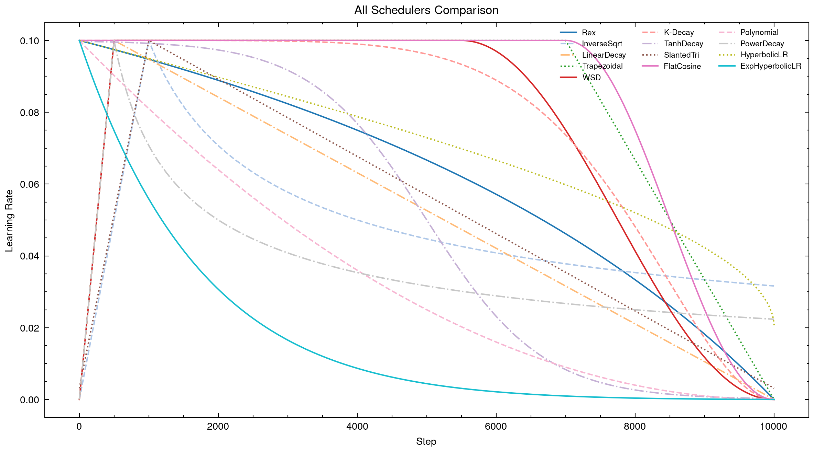
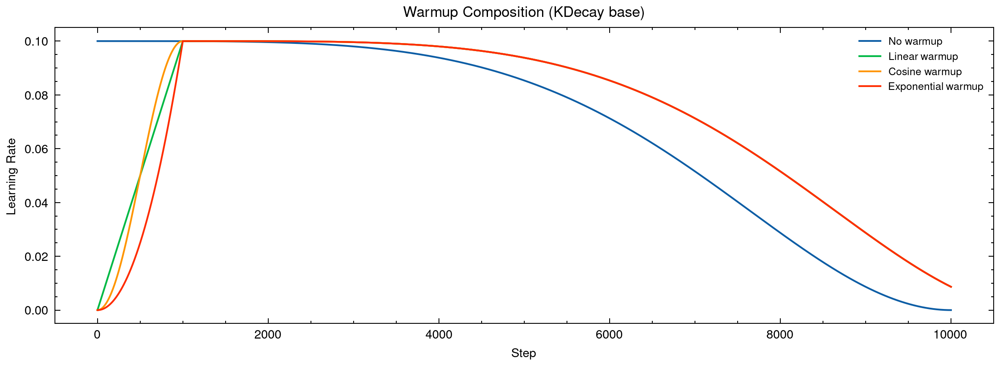
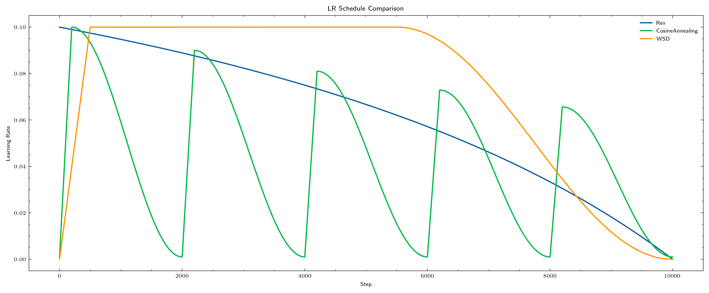

# pytorch-scheduler

[](https://github.com/axect/pytorch-scheduler/actions/workflows/ci.yml)
[](https://pypi.org/project/pytorch-scheduler/)
[](https://pypi.org/project/pytorch-scheduler/)
[](LICENSE)

A comprehensive, research-driven collection of learning rate schedulers for PyTorch — with 18 ready-to-use schedulers, composable warmup wrappers, opinionated presets, and first-class paper references.



## Installation

```bash
pip install pytorch-scheduler

# With visualization support
pip install "pytorch-scheduler[viz]"
```

## Which Scheduler Should I Use?

| Training Scenario | Recommended Preset | Scheduler | Key Idea |
|---|---|---|---|
| LLM pre-training | `llm_pretrain` | WSD | Warmup → stable → cosine decay |
| LLM fine-tuning | `llm_finetune` | CosineWithWarmup | Short warmup + cosine decay |
| Vision fine-tuning | `vision_finetune` | CosineWithWarmup | Moderate warmup + cosine decay |
| Vision pre-training | `vision_pretrain` | WarmupHoldCosine | Warmup → hold → cosine decay |
| Transfer learning (small data) | `transfer_small_data` | SlantedTriangular | Short warmup + long linear decay |
| Fixed compute budget | `budgeted_training` | Rex | Budget-optimal allocation |
| HPO → full training | — | HyperbolicLR / ExpHyperbolicLR | Tune at small epochs, train at large epochs |

### Using Presets (Recommended)

```python
import torch
from pytorch_scheduler import create_from_preset

model = torch.nn.Linear(10, 1)
optimizer = torch.optim.AdamW(model.parameters(), lr=1e-3)

# One line — the library picks the right scheduler and defaults
scheduler = create_from_preset(optimizer, 'llm_pretrain', total_steps=100000)

for step in range(100000):
    loss = train_step(model, optimizer)
    scheduler.step()
```

### Using Schedulers Directly

```python
from pytorch_scheduler import CosineWithWarmupScheduler, RexScheduler, WarmupScheduler

# Most common: cosine with warmup
scheduler = CosineWithWarmupScheduler(
    optimizer, total_steps=10000, warmup_steps=500, min_lr=1e-5
)

# Budget-optimal
scheduler = RexScheduler(optimizer, total_steps=10000)

# Compose any scheduler with warmup
base = RexScheduler(optimizer, total_steps=10000)
scheduler = WarmupScheduler(optimizer, base, warmup_steps=500, warmup_type="cosine")
```

### Auto-Config from Training Plan

```python
from pytorch_scheduler import create_scheduler_from_plan

# Automatically computes total_steps = epochs × steps_per_epoch ÷ grad_accum
scheduler = create_scheduler_from_plan(
    optimizer, "wsd",
    epochs=10, steps_per_epoch=500, grad_accum_steps=4,
    warmup_steps=100, stable_steps=500,
)
```

## All Schedulers (18)

> **Detailed API reference** with formulas, parameters, and examples: [docs/schedulers.md](docs/schedulers.md)

| Scheduler | Description | Paper | Year |
|---|---|---|:---:|
| `CosineWithWarmupScheduler` | Linear warmup + cosine decay (no restart) — the modern default | — | — |
| `WarmupHoldCosineScheduler` | Warmup → hold at peak LR → cosine decay — three-phase schedule | — | — |
| `InverseSqrtScheduler` | Inverse square-root with built-in warmup (Transformer default) | [Attention is All You Need](https://arxiv.org/abs/1706.03762) | 2017 |
| `CosineAnnealingWarmupRestarts` | SGDR with per-cycle warmup and max-LR decay | [SGDR: Stochastic Gradient Descent with Warm Restarts](https://arxiv.org/abs/1608.03983) | 2017 |
| `TanhDecayScheduler` | Hyperbolic-tangent decay with steepness control | [Online Learning Rate Adaptation with Hypergradient Descent](https://arxiv.org/abs/1703.04782) | 2018 |
| `SlantedTriangularScheduler` | Short warmup + longer linear decay (ULMFiT) | [Universal Language Model Fine-tuning for Text Classification](https://arxiv.org/abs/1801.06146) | 2018 |
| `KDecayScheduler` | k-decay modifier on cosine schedule | [k-decay: A New Method for Learning Rate Schedule](https://arxiv.org/abs/2004.05909) | 2020 |
| `PowerDecayScheduler` | Power-law decay `step^{-alpha}` after warmup | [Scaling Laws for Neural Language Models](https://arxiv.org/abs/2001.08361) | 2020 |
| `RexScheduler` | Reciprocal decay `(1-t)/(1-t/2)` for budgeted training | [Revisiting Budgeted Training with an Improved Schedule](https://arxiv.org/abs/2107.04197) | 2022 |
| `LinearDecayScheduler` | Linear warmup then linear decay to `min_lr` | [Scaling Laws and Compute-Optimal Training Beyond Fixed Training Durations](https://arxiv.org/abs/2405.18392) | 2024 |
| `WSDScheduler` | Warmup–Stable–Decay with cosine/linear/sqrt decay | [MiniCPM: Unveiling the Potential of Small Language Models](https://arxiv.org/abs/2404.06395) | 2024 |
| `HyperbolicLRScheduler` | Hyperbolic decay curve, epoch-insensitive | [HyperbolicLR: Epoch Insensitive Learning Rate Scheduler](https://arxiv.org/abs/2407.15200) | 2024 |
| `ExpHyperbolicLRScheduler` | Exponential variant of hyperbolic decay | [HyperbolicLR: Epoch Insensitive Learning Rate Scheduler](https://arxiv.org/abs/2407.15200) | 2024 |
| `TrapezoidalScheduler` | Three-phase: warmup / constant / linear decay | — | — |
| `FlatCosineScheduler` | Flat phase at `base_lr` then cosine annealing | — | — |
| `PolynomialScheduler` | Polynomial decay with optional cycling | — | — |
| `ChebyshevScheduler` | Non-monotonic schedule using Chebyshev nodes | — | — |
| `IdentityScheduler` | No-op scheduler — keeps LR constant (baseline) | — | — |

## Scheduler Cards

### CosineWithWarmup — The Modern Default

**When to use:** Fine-tuning LLMs/ViTs, general-purpose training

**When NOT to use:** Pre-training from scratch (consider WSD instead)

**Key parameters:** `warmup_steps`, `min_lr`

**Shape:** Linear ramp → smooth cosine decay

### WSD (Warmup-Stable-Decay) — LLM Pre-training

**When to use:** Large-scale pre-training with known compute budget

**When NOT to use:** Short fine-tuning runs

**Key parameters:** `warmup_steps`, `stable_steps`, `decay_type`

**Shape:** Linear ramp → flat → cosine/linear decay

### WarmupHoldCosine — Vision Pre-training

**When to use:** Pre-training ViTs on large image datasets; maximizes time at peak LR

**When NOT to use:** Quick fine-tuning experiments

**Key parameters:** `warmup_steps`, `hold_steps`, `min_lr`

**Shape:** Linear ramp → flat hold at peak → cosine decay

### Rex — Budget-Optimal

**When to use:** Fixed compute budget, want optimal LR allocation

**When NOT to use:** When you need warmup (wrap with `WarmupScheduler`)

**Key parameters:** None beyond `total_steps`

**Shape:** Smooth reciprocal decay

### HyperbolicLR / ExpHyperbolicLR — HPO-Friendly

**When to use:** Hyperparameter optimization (HPO) workflows where you tune at small epoch counts and then train the best config at large epoch counts. The epoch-insensitive decay curve means the LR schedule shape is preserved regardless of total epochs, so rankings from short HPO runs transfer reliably to full training.

**When NOT to use:** When your training length is fixed and you want precise control over decay timing

**Key parameters:** `upper_bound`, `max_iter` (HyperbolicLR, ExpHyperbolicLR)

**Shape:** Hyperbolic (linear variant) or exponential-hyperbolic decay — consistent shape across different epoch counts

## Warmup Composition

Any scheduler can be wrapped with a warmup phase using `WarmupScheduler`:

```python
from pytorch_scheduler import WarmupScheduler, KDecayScheduler

base = KDecayScheduler(optimizer, total_steps=10000, k=2.0)
scheduler = WarmupScheduler(
    optimizer,
    base_scheduler=base,
    warmup_steps=500,
    warmup_type="linear",  # "linear" | "cosine" | "exponential"
)
```



> **Note:** `InverseSqrtScheduler` has warmup built into its formula. Do **not** wrap it with `WarmupScheduler` — doing so would apply warmup twice.

## Presets

```python
from pytorch_scheduler import list_presets, get_preset_info, create_from_preset

# See all presets
print(list_presets())
# ['llm_pretrain', 'llm_finetune', 'vision_finetune', 'vision_pretrain', 'transfer_small_data', 'budgeted_training']

# Get details
info = get_preset_info('llm_pretrain')
print(info['description'])  # Warmup-Stable-Decay for large language model pretraining

# Create from preset with overrides
scheduler = create_from_preset(optimizer, 'llm_pretrain', total_steps=50000, decay_type='linear')
```

## Experimental Features

### SequentialComposer

Chain multiple schedulers at specified step milestones:

```python
from pytorch_scheduler.experimental import SequentialComposer
from pytorch_scheduler import LinearDecayScheduler, RexScheduler

s1 = RexScheduler(optimizer, total_steps=500)
s2 = LinearDecayScheduler(optimizer, total_steps=500)

scheduler = SequentialComposer(
    optimizer,
    schedulers=[s1, s2],
    milestones=[500],  # switch to s2 at step 500
)
```

### ScheduleFreeWrapper

Schedule-free optimization via online-to-batch conversion:

```python
from pytorch_scheduler.experimental import ScheduleFreeWrapper

wrapper = ScheduleFreeWrapper(optimizer, warmup_steps=1000, beta=0.9)

for step in range(total_steps):
    wrapper.train()
    loss = model(x).sum()
    loss.backward()
    wrapper.step()
    optimizer.zero_grad()

# For evaluation
wrapper.eval()
val_loss = evaluate(model)
```

> **Reference:** [The Road Less Scheduled](https://arxiv.org/abs/2405.15682) (Defazio et al., 2024)

## Visualization

Plots use [SciencePlots](https://github.com/garrettj403/SciencePlots) (`science` + `nature` style) automatically when installed. Falls back to default matplotlib style otherwise.

```python
import torch
from pytorch_scheduler import RexScheduler, CosineAnnealingWarmupRestarts, WSDScheduler
from pytorch_scheduler.visualization import compare_schedules

optimizer = torch.optim.AdamW([torch.randn(2, requires_grad=True)], lr=0.1)
total_steps = 10000

fig = compare_schedules(
    {
        "Rex": RexScheduler(optimizer, total_steps=total_steps),
        "CosineAnnealing": CosineAnnealingWarmupRestarts(
            optimizer, first_cycle_steps=2000, warmup_steps=200,
            max_lr=0.1, min_lr=0.001, gamma=0.9,
        ),
        "WSD": WSDScheduler(
            optimizer, total_steps=total_steps,
            warmup_steps=500, stable_steps=5000,
        ),
    },
    total_steps=total_steps,
)
fig.savefig("comparison.png", dpi=300)
```



## Factory API

```python
from pytorch_scheduler import create_scheduler, create_scheduler_from_plan, load_scheduler, get_supported_schedulers

# List available schedulers
print(get_supported_schedulers())            # all 18
print(get_supported_schedulers("*cosine*"))  # pattern matching

# Load by name
cls = load_scheduler("rex")
scheduler = cls(optimizer, total_steps=10000)

# Create directly
scheduler = create_scheduler(optimizer, "wsd", total_steps=10000, warmup_steps=500, stable_steps=3000)

# Auto-compute total_steps from training plan
scheduler = create_scheduler_from_plan(
    optimizer, "wsd",
    epochs=10, steps_per_epoch=500, grad_accum_steps=4,
    warmup_steps=100, stable_steps=500,
)
```

## API Reference

All schedulers follow PyTorch's `LRScheduler` protocol:

```python
scheduler.step()              # advance one step
scheduler.get_last_lr()       # current LR(s)
scheduler.state_dict()        # serialize state
scheduler.load_state_dict()   # restore state

# Pure functional interface — compute LR at any step without side effects
lr = scheduler._lr_at(step, base_lrs)
```

Every scheduler exposes paper metadata:

```python
scheduler.paper_title  # str
scheduler.paper_url    # str
scheduler.paper_year   # int
```

Step-semantics metadata:

```python
scheduler.step_unit         # 'step' | 'epoch'
scheduler.needs_total_steps  # bool
```

## Acknowledgments

This project is inspired by [**pytorch-optimizer**](https://github.com/kozistr/pytorch_optimizer) — a fantastic collection of optimization algorithms for PyTorch with paper references and clean API design. If you're looking for optimizers to pair with these schedulers, check it out!

## License

Apache-2.0
